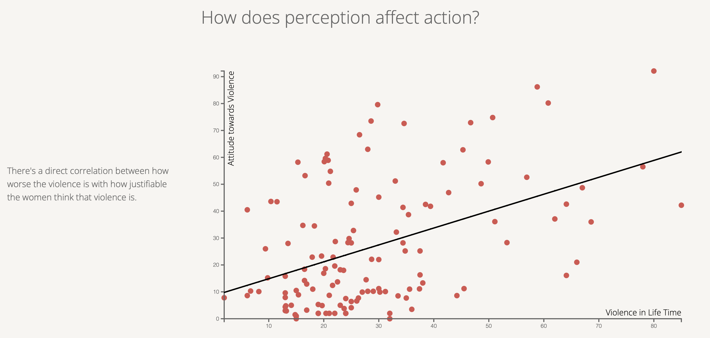

# Perception of violence against women across the globe:

### Aditya Boghara, Vyom Desai, Tommy Tran & Sanjana Shah.

## Overview

In this system, you are going to see several graphs arguing about the various trends about oppression against women. As a part of our story we’ll present the information across various demographics and explore the solutions that have the potential to improve the ideology surrounding women’s rights. This project is inspired by the ongoing women’s rights protests in Iran.

## Data description

### Data Set 1:

*Domain Specific Discussion: This dataset is the Violence Against Women and Girl Data set which was collected as a part of the [Demographic and Health Surveys (DHS)](https://dhsprogram.com/What-We-Do/Survey-Types/DHS.cfm) program. This dataset provides us with the percentage of people from a certain demographic and country that agree with the questions that they were asked. So for example, a certain data point could tell how, the percentage of females from Afghanistan, whose education level is up to Primary school, who think that a husband is justified in h*itting or beating his wife if she burns the food.

<https://www.kaggle.com/datasets/andrewmvd/violence-against-women-and-girls/code>

#### Abstraction:

#### Data type: A table with attributes and items

#### Attributes: 

- RecordID:
  - Type: Integer
  - Cardinality: 420

- Country:
  - Type: String
  - Cardinality: 70

- Gender
  - Type: String / Character / Binary
  - Cardinality: M / F (male and female)

- Demographics Question:
  - Type: String 
  - Cardinality: 5 (Age, Education, Marital status, Employment, Residence)

- Demographics Response:
  - Type: String 
  - Cardinality: 15
- Question
  - Type: String
  - Cardinality: 6
- Survey Year
  - Type: Date
  - Cardinality: 18
- Value
  - Type: Number

### Dataset 2:

Domain Specific Discussion: This dataset is the Violence Against Women which was collected as a part of the Organisation for economic Co-operation and development. This dataset provides us with the attitude towards violence, the law score of each country, and the chance of experience of the type of violence.

<https://data.oecd.org/inequality/violence-against-women.htm>

#### Attribute:

#### Datatype: Table with attributes and items
#### Attributes:

- Location
  - Type: String
  - Cardinality: 164
- Indicator:
  - Type: String
  - Cardinality: 1
- Subject
  - Type: String
  - Cardinality: 3
- Measure:
  - Type: String
  - Cardinality: 3
- Frequency:
  - Type: Char
  - Cardinality: 1
- Time:
  - Type: Date
  - Cardinality: 1
- Value:
  - Type: Double

## Goals and Tasks

- Find attributes that contribute to improving the ideology of woman’s right
- Discover correlations between factors like perception as violence against women, or laws that discriminate against women and the percentage of women who have faced sexual violence from someone they knew. 
- Compare the distribution among countries for the percentage of women who have faced sexual violence from someone they knew per country
- Browse the following attributes for all countries to find variables that are causing factors and potential solutions for women's right

## Idioms

1. A heat bubble chart to show each country’s score on justifiable violence. Users can view this graph and see the prevalence of violence on a vertical axis and each elemental bubble having a color scale that represents the attitude towards violence. Having this chart helps us identify the correlation of lower exposure to violence means there is also a higher chance that the attitude towards violence will be significantly high. No algorithms were used.  

2. A slope chart to show a comparison between a developed country and a developing country. The user can observe and hover over each line to show the United States traits over India’s traits. The green line is the law discrimination, the orange line is Prevalence of violence in a lifetime, and the red line is the attitude towards violence. It seems that the laws discrimination are equal but the prevalence of violence and attitude towards violence are not the same between an example developed country and a developing country. It leads us to a conclusion that laws may not be the causing issue for our subject. No algorithms were used.

3. Multiple bar charts for a male and female comparison on their perception of violence. The users can observe the chart and see each of the demographics. The traits are the age, education, employment, marriage status, and area of residence. Out of the five traits, education seems to be the most impactful and the prime suspect for a major variable that can help up find a solution. No algorithms were used.

4. A Pie chart showing the Perception of violence having a correlation with employment. The users can observe and hover over each of the pie chart’s variables. We are showing five countries and each pie chart will have 3 traits, Employment for kind, Employment for cash, and unemployment. No algorithms were used.

5. A Scatter plot to show the violence experiences having a correlation with the attitude towards violence. The users can observe the graph with the x-axis being the Violence in a lifetime and the y-axis representing the Attitude towards violence. We have also added a line of best fit, to show the correlation. The users will see that as a person gains more exposure of violence throughout their lifetime, their attitude towards it will increase as well, indication that the amount of prevalence can play a key role into the attitude. No algorithms were used.
6. Slopegraph to show the relationship of education and the percentage of violence. Users can observe and hover over each line to highlight the traits. Each line will go through the type of education, No education, primary, secondary, and higher. As the person gains a higher level of education, the chances of their attitude towards violence decreases significantly in most cases, indicating that education can play a major role into our topic. No algorithms were used.
7. A Giga graph to show multiple attributes of the datasets of our topic. The users can set the settings of the graph to produce a lollipop chart with genders comparison based on the question, the country, and the demographic selected. What we found is no matter what the question or country is, if we were to select the education level the correlation of male and female attitude of the question will significantly decrease as the person achieves a higher level of education. No algorithms were used.

## Reflection

In the beginning our graphs were agreed upon with each of the traits and assessments. The only changes we made from the WIP to the final stage was the innovation graph. We changed from a geo-visualization graph to a color scaled bubble chart for workability and the graph aligns with our goals of information presentation more. Otherwise, the rest of the graphs were finished on time. We found very interesting variables for the causes of the protest for women’s rights and showed potential solutions.

The goal of the project was the same but there was a slight change in the type of graph that we decided to make. The project seems very realistic from the start as we were able to find a lot of data related to it. The topic is a kind of very concerning topic in the world right now as lots of women nowadays are facing this problem. 

We don't think we had any unexpected changes that we needed to make. We believe the only problem that we faced were the developing problems. There were times when it took time to understand the graph and its implementation. Also, we spend a lot of time cleaning the data. We did cover most of the things that we wanted to. There were few changes which were made, but they were not too severe. The thing that we would do differently next time would be to broaden the topic a bit more and get as much information and data as possible to make as many charts and graphs as possible which will ultimately support the most important and disturbing concern of the society. Overall the whole project was fun and interesting. We came across a lot of new and interesting information. 

## Team workload

|Task|Assignee|Due Date|
| :- | :- | :- |
|Setting up the outline of the data scrolling page|Sanjana|10/26/2022|
|
Visualization 1: Color-scale bubble graph to show each country’s score on justifiable violence

Visualization 2: A slope graph to show the comparison between a developed and developing country.  

Visualization 6: Slopegraph to show the relationship of education and the percentage of violence

|Sanjana|11/04/2022|
|

Visualization 3: A bar chart for a male and female comparison 
|Vyom|11/04/2022|
|
Visualization 4: A Pie chart showing the Perception of violence having a correlation with employment

Visualization 5: A Scatter plot to show the violence experiences having a correlation with the attitude towards violence
|Aditya|11/04/2022|
|Visualization 7: A Giga graph to show multiple attributes of the datasets of our topic|Tommy|11/04/2022|
|Text write up and CSS editing respective graphs|Sanjana, Vyom, Aditya, Tommy|11/11/2022|
|Poster for the project|Sanjana, Vyom, Aditya, Tommy|11/23/2022|

